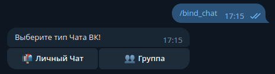
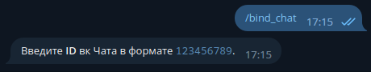
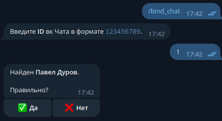
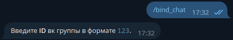
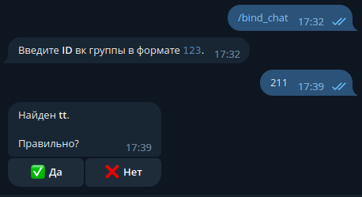

# VK-TG-SYNC | Синхронизация чатов между Вконтакте и Телеграмом

> [!NOTE]
> Этот скрипт предназначен для пользователей, которые уже давно сделали Телеграм своим основным мессенджером, но у них все еще есть чаты во Вконтакте, в которых им приходится участвовать. Скрипт позволяет перенести эти чаты из Вконтакте в Телеграм и упростить процесс коммуникации.

> [!WARNING]
> На данный момент скрипт находится в недоделанном виде и может иметь ограничения и проблемы. Пожалуйста, учитывайте это при его использовании.


## Запуск в Docker
Вы также можете запустить `vk-tg-sync` в Docker, прочитать об этом подробнее можете [здесь](DOCKER-RUN.md)

## 🚀 Установка

1. Склонируйте репозиторий GitHub:

   ```shell
   git clone https://github.com/Delitel-WEB/vk-tg-sync.git
   ```

2. Перейдите в директорию проекта:

   ```shell
   cd vk-tg-sync
   ```

3. Установите необходимые пакеты Python из файла `req.txt`:
   ```shell
   pip install -r req.txt
   ```

## ⚙️ Настройка

1. Создайте файл `settings.sh` для Linux.

   ```shell
   export TG_BOT_TOKEN="ВАШ_ТОКЕН_ТЕЛЕГРАМ_БОТА"
   export VK_BOT_TOKEN="ВАШ_ТОКЕН_ПОЛЬЗОВАТЕЛЬСКОГО_АККАУНТА"
   export DB_PASS="ПАРОЛЬ_К_БД_MYSQL"
   export DB_IP="IP_БАЗЫ_ДАННЫХ"
   export DB_NAME="НАЗВАНИЕ БД"
   ```

   Токен ВК можно получить [здесь](https://vkhost.github.io/). У токена должно быть разрешение к сообщениям!


2. Создайте таблицы в базе данных:

   ```shell
   alembic upgrade head
   ```

   ⚠️ Перед выполнением этой команды убедитесь, что у вас установлена база данных MySQL и создана указанная таблица `DB_NAME`.

## ▶️ Запуск бота

⚠️ Перед запуском убедитесь, что вы установили значения переменных в файле `settings.sh`.

Перед запуском выполните следующую команду для установки переменных в окружение терминала:

```shell
source settings.sh
```

И запустите скрипт:

```shell
python main.py
```

# 🚀 Инструкция по использованию

После запуска бота, вы можете связать чаты во ВКонтакте и Telegram, отправив боту команду `/bind_chat`.

Бот предложит вам выбрать тип чата во ВКонтакте: групповой или личный чат.



## Личный чат



Для связи личного чата вам потребуется предоставить боту `ID` пользователя ВКонтакте.

Вы можете найти `ID` пользователя в ссылке на его профиль, которая может выглядеть, например, как `vk.com/id1`.

Если у ссылки на профиль пользователя есть пользовательское имя, например, `vk.com/durov`, вы можете извлечь `ID` его профиля с помощью любого приложения, позволяющего извлекать `ID` из ссылок, например, [это приложение](https://vk.com/linkapp).

После ввода `ID` пользователя, бот напишет вам имя выбранного вами пользователя и попросит подтвердить ваш выбор.



## Группа



Для связи бесед ВКонтакте вам потребуется получить их `ID`.

Для каждой беседы `ID` имеет свой уникальный идентификатор.

Получить его можно, кликнув в браузере на беседу и посмотрев в ссылку `https://vk.com/im?sel=c147`.
Число `147` в этой ссылке является `ID` беседы ВКонтакте.

После ввода `ID` группы, бот напишет вам название выбранной вами беседы и попросит подтвердить ваш выбор.



После этого бот попросит вас отправить `ID` группы в Telegram.

> ⚠️ Бот должен находиться в этой группе и быть администратором.

> ⚠️ Внимание!!! Если группа станет супергруппой, ее `ID` изменится.

`ID` группы Telegram можно получить, отправив команду `/id` в группе, в которую добавлен бот.

После успешного связывания чатов, бот изменит название и фотографию группы в Telegram на такие же, как во ВКонтакте.

# Что реализовано на данный момент

> **Синхронизация указана в виде мессенджер ➔ мессенджер. То есть если галочка стоит у ВКонтакте, то сделана синхронизация VK ➔ Telegram и наоборот. Если галочки стоят сразу на двух мессенджерах, значит, синхронизация двусторонняя.**

| Виды синхронизации       | Telegram | VKontakte |
| ------------------------ | -------- | --------- |
| **Сообщения**            |          |           |
| Текстовые сообщения      | ❌       | ✅        |
| Голосовые сообщения      | ❌       | ✅        |
| Стикеры                  | ❌       | ✅        |
| Пересланные сообщения    | ❌       | ❌        |
| Документы                | ❌       | ✅        |
| Удаление сообщений       | ❌       | ❌        |
| Редактирование сообщений | ❌       | ❌        |
| **Медиа**                |          |           |
| Фото                     | ❌       | ✅        |
| Видео                    | ❌       | ✅        |
| Кружки                   | ❌       | ✅        |
| Геолокация               | ❌       | ✅        |
| Посты                    | ❌       | ❌        |
| **Действия с чатами**    |          |           |
| Изменение Фото           | ❌       | ❌        |
| Изменение Названия Чата  | ❌       | ❌        |
